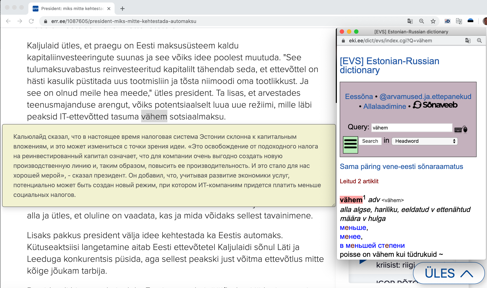

## Motivation

Estonian is one of most difficult European language. This Chrome Plugin is intended for helping learning Estonian by reading and translating text from Estonian. There are some obstacles while studying:
- Google translate can understand a meaning in overrall but sometimes it is not enough
- Offical Estonian dictionary (developed by [EKI](https://portaal.eki.ee) or "Eesti Keel Instituut") is essential tool for studying Estonian.

So, the aim of this Chrome plugin - is to integrate two tools into single one and make it simple to display translation from Google and lookup a word from EKI source.

## How to install

Download source code from github, open chrome://extensions/, click on "Load unpacked" and select directory with source files.

## How to use

On a page with estonian, select a text and then press 'q' key that will display translation from Google in popup.
If you want check a particular word from EKI dictionary (please note, EKI doesn't make translation of sentence), select this work and press 'e' key.

## Attention

Only translation from Estonian to Russian is currently supported.

